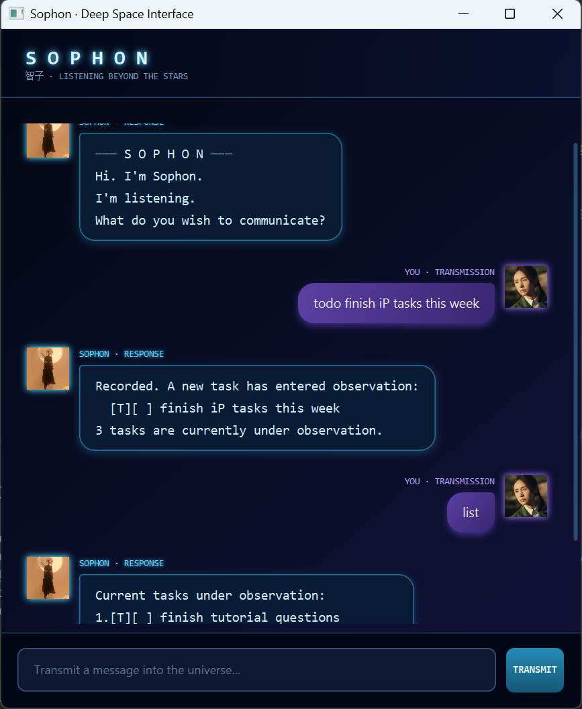

# Sophon User Guide

Sophon is a desktop task chatbot for tracking todos, deadlines, and events.
It remembers your tasks between sessions and responds through a space-themed
chat interface.



## Contents

- [Quick start](#quick-start)
- [Command summary](#command-summary)
- [Adding tasks](#adding-tasks)
- [Viewing and finding tasks](#viewing-and-finding-tasks)
- [Updating tasks](#updating-tasks)
- [Saving and loading](#saving-and-loading)
- [Handling mistakes](#handling-mistakes)
- [Exiting](#exiting)

## Quick start

1. Install Java 25.
2. Download `sophon.jar` from the latest GitHub release.
3. Open a terminal in the folder containing the JAR file.
4. Run `java -jar sophon.jar`.
5. Enter a command in the message field and press **Enter** or select
   **Transmit**.

Some Java distributions bundle JavaFX as named modules. If Java prints a
native-access warning when Sophon starts, use this equivalent command:

```text
java --enable-native-access=javafx.graphics -jar sophon.jar
```

The warning does not indicate that Sophon failed to start. It warns that a
future Java release may require the option above.

> [!TIP]
> Dates must use the `yyyy-MM-dd` format. For example, Christmas Day 2026 is
> written as `2026-12-25`.

## Command summary

| Action | Command format | Example |
|---|---|---|
| Add a todo | `todo DESCRIPTION` | `todo borrow book` |
| Add a deadline | `deadline DESCRIPTION /by DATE` | `deadline return book /by 2026-09-20` |
| Add an event | `event DESCRIPTION /from DATE /to DATE` | `event project meeting /from 2026-09-20 /to 2026-09-21` |
| View all tasks | `list` | `list` |
| Find tasks | `find KEYWORD` | `find book` |
| Mark a task as complete | `mark NUMBER` | `mark 2` |
| Mark a task as incomplete | `unmark NUMBER` | `unmark 2` |
| Delete a task | `delete NUMBER` | `delete 2` |
| Exit Sophon | `bye` | `bye` |

## Adding tasks

### Adding a todo

Use `todo` followed by a description:

```text
todo borrow book
```

Sophon responds with the saved task:

```text
Recorded. A new task has entered observation:
  [T][ ] borrow book
1 tasks are currently under observation.
```

### Adding a deadline

Use `deadline`, a description, `/by`, and a date:

```text
deadline return book /by 2026-09-20
```

```text
Recorded. A new deadline has entered observation:
  [D][ ] return book (by: Sep 20 2026)
1 tasks are currently under observation.
```

### Adding an event

Use `event`, a description, `/from`, the start date, `/to`, and the end date:

```text
event project meeting /from 2026-09-20 /to 2026-09-21
```

```text
Recorded. A new event has entered observation:
  [E][ ] project meeting (from: Sep 20 2026 to: Sep 21 2026)
1 tasks are currently under observation.
```

## Viewing and finding tasks

### Listing all tasks

Enter `list` to see every saved task and its current number:

```text
Current tasks under observation:
1.[T][ ] borrow book
2.[D][ ] return book (by: Sep 20 2026)
3.[E][ ] project meeting (from: Sep 20 2026 to: Sep 21 2026)
```

### Finding tasks

Use `find` followed by a search term:

```text
find book
```

Search is case-insensitive, accepts partial words, and tolerates small typing
errors. For example, `find bok` can match a task containing `book`. Short words
require closer matches to avoid unrelated results.

## Updating tasks

Task numbers come from the most recent `list` output.

### Marking a task

Use `mark NUMBER` to mark a task as complete:

```text
mark 2
```

Use `unmark NUMBER` to mark it as incomplete again:

```text
unmark 2
```

`[X]` represents a completed task, while `[ ]` represents an incomplete task.

### Deleting a task

Use `delete NUMBER` to remove a task permanently:

```text
delete 2
```

Task numbers may change after deletion. Enter `list` again before updating
another task if you are unsure of its new number.

## Saving and loading

Sophon saves automatically after adding, marking, unmarking, or deleting a
task. Saved data is stored in `data/sophon.txt`, relative to the folder from
which Sophon is launched.

If the `data` folder or save file does not exist, Sophon starts with an empty
task list and creates them when it first saves. If an existing file cannot be
read, Sophon displays a warning and starts safely with an empty list.

> [!WARNING]
> Do not include ` | ` in task descriptions. Sophon uses that sequence to
> separate fields in its save file.

## Handling mistakes

Sophon explains malformed commands instead of terminating unexpectedly.

| Input | Problem |
|---|---|
| `todo` | The todo description is missing. |
| `deadline return book` | The `/by` date is missing. |
| `event meeting /from 2026-09-20` | The `/to` date is missing. |
| `mark abc` | Task numbers must be numerals. |
| `delete 99` | No task exists at that number. |
| `find` | The search term is missing. |

For an unknown command, Sophon reports that it could not determine the
message's meaning. Correct the command and try again.

## Exiting

Enter `bye` to display Sophon's farewell. The application disables further
input and closes after approximately three seconds.
